# Pinpoint AI MVP - Inventory Matching & Pricing Intelligence Platform

## Overview

Pinpoint AI is a SaaS that takes poorly-defined inventory (CSV/Excel line sheets, images/PDFs of catalogs) and uses AI to match items to real-world product identifiers (Amazon ASINs, UPCs). It then provides market pricing intelligence for those matched items. Users pay per line/match on tiered pricing plans.

## Problem Statement

Companies with inventory (distributors, wholesalers, resellers, liquidators) often have messy product data — supplier line sheets with inconsistent naming, no barcodes, photos of catalogs, etc. They need to:

1. **Identify what they actually have** — match fuzzy descriptions to canonical products (UPCs, ASINs)
2. **Understand market value** — see what items sell for on Amazon to make buy/sell decisions

Today this is done manually or with fragile keyword-search tools. LLMs + vision models make it possible to automate this at high accuracy.

## Proposed Solution

A web application where users upload inventory (CSV, Excel, images, PDFs), Pinpoint AI extracts and normalizes items, matches them to products in external databases (UPC databases + Amazon), and surfaces pricing intelligence. Users review AI matches, confirm/correct them, and get a dashboard of matched inventory with market data.

---

## Technical Approach

### Architecture

```
┌──────────────────────────────────────────────────────────────┐
│                     VERCEL (Frontend)                         │
│                                                              │
│  Next.js 15 App Router + shadcn/ui + React 19               │
│  ┌────────────┐  ┌────────────┐  ┌─────────────────────┐    │
│  │ Upload Flow │  │ Review UI  │  │ Dashboard / Pricing │    │
│  └─────┬──────┘  └─────┬──────┘  └──────────┬──────────┘    │
│        │               │                     │               │
│  Next.js API Routes (proxy to backend)                       │
└────────┼───────────────┼─────────────────────┼───────────────┘
         │               │                     │
         ▼               ▼                     ▼
┌──────────────────────────────────────────────────────────────┐
│                  GCP (Backend Services)                       │
│                                                              │
│  ┌─────────────────────────────────────────────────────┐     │
│  │ API Service (Express/Fastify) — Cloud Run            │     │
│  │ • Auth (JWT access/refresh tokens)                   │     │
│  │ • Upload handling (GCS)                              │     │
│  │ • Line sheet CRUD                                    │     │
│  │ • Match review endpoints                             │     │
│  │ • Pricing data endpoints                             │     │
│  │ • Billing/usage tracking                             │     │
│  └──────────────────────┬──────────────────────────────┘     │
│                         │ enqueue jobs                        │
│                         ▼                                    │
│  ┌─────────────────────────────────────────────────────┐     │
│  │ Job Service (RabbitMQ) — Cloud Run / GCE             │     │
│  │                                                      │     │
│  │ Pipeline stages (each a RabbitMQ queue):               │     │
│  │ 1. EXTRACTION — CSV parse or vision/OCR              │     │
│  │ 2. NORMALIZATION — brand/size/category cleanup       │     │
│  │ 3. MATCHING — UPC lookup → Amazon search → LLM rank  │     │
│  │ 4. PRICING — Keepa/PA-API market data fetch          │     │
│  └──────────────────────┬──────────────────────────────┘     │
│                         │                                    │
│  ┌──────────┐  ┌────────┴───────┐  ┌───────────────┐        │
│  │ Cloud SQL│  │ Redis on GCE    │  │ GCS (uploads) │        │
│  │ Postgres │  │ RabbitMQ on GCE │  │               │        │
│  │ + pgvector│  └────────────────┘  └───────────────┘        │
│  └──────────┘                                                │
└──────────────────────────────────────────────────────────────┘
```

### Tech Stack

| Layer                   | Technology                         | Rationale                                                              |
| ----------------------- | ---------------------------------- | ---------------------------------------------------------------------- |
| Frontend                | Next.js 15 (App Router) + React 19 | Matches Breakdown patterns, SSR for SEO/marketing pages                |
| UI                      | shadcn/ui + Radix + Tailwind       | User preference; component library with good defaults                  |
| Backend API             | Express.js + TypeScript            | Matches Breakdown patterns; familiar to Ryan                           |
| ORM                     | Prisma v6                          | Matches Breakdown patterns; strong TypeScript integration              |
| Database                | PostgreSQL 17 + pgvector           | Relational data + vector similarity search for product matching        |
| Job Queue               | RabbitMQ                           | Simpler than NATS for this use case; good for background job pipelines |
| File Storage            | Google Cloud Storage               | GCP-native, presigned URLs for direct upload                           |
| Cache                   | Redis                              | Deduplication, API response caching, session cache                     |
| Auth                    | JWT (access + refresh tokens)      | Matches Breakdown patterns                                             |
| Payments                | Stripe                             | Usage-based billing with metered subscriptions                         |
| LLM (vision/extraction) | Claude Sonnet (Anthropic)          | Best at unstructured table extraction from images                      |
| LLM (matching/ranking)  | Claude Sonnet + Haiku              | Sonnet for ranking, Haiku for normalization/cheap tasks                |
| LLM (fallback)          | GPT-4o-mini via OpenRouter         | Multi-provider for cost optimization and redundancy                    |
| Deployment (frontend)   | Vercel                             | Zero-config Next.js deployment                                         |
| Deployment (backend)    | GCP Cloud Run                      | Matches Breakdown patterns; auto-scaling                               |
| Deployment (jobs)       | GCE (e2-small) or Cloud Run        | Long-running job processor; GCE is cheaper for persistent workers      |
| IaC                     | Terraform                          | Matches Breakdown patterns                                             |

### Monorepo Structure

```
pinpoint-ai/
├── web/                          # Next.js frontend (Vercel)
│   ├── src/
│   │   ├── app/                  # App Router pages
│   │   │   ├── (auth)/           # Login, signup, forgot password
│   │   │   ├── (dashboard)/      # Authenticated routes
│   │   │   │   ├── uploads/      # Upload management
│   │   │   │   ├── sheets/[id]/  # Line sheet detail + review UI
│   │   │   │   ├── pricing/      # Pricing intelligence dashboard
│   │   │   │   └── settings/     # Account, billing, API keys
│   │   │   └── (marketing)/      # Landing page, pricing page
│   │   ├── components/
│   │   │   ├── ui/               # shadcn/ui components
│   │   │   └── features/         # Feature-specific components
│   │   ├── lib/
│   │   │   ├── api-server.ts     # Server-side API client (proxy pattern)
│   │   │   ├── api-client.ts     # Client-side API helpers
│   │   │   └── auth/             # Auth context + helpers
│   │   └── types/                # Shared frontend types
│   ├── package.json
│   └── next.config.ts
│
├── backend/                      # Express API + Job service
│   ├── src/
│   │   ├── services/
│   │   │   ├── api-service/      # Express REST API
│   │   │   │   ├── index.ts      # Express app setup
│   │   │   │   ├── routes/       # Route handlers
│   │   │   │   │   ├── auth.router.ts
│   │   │   │   │   ├── sheets.router.ts
│   │   │   │   │   ├── matches.router.ts
│   │   │   │   │   ├── pricing.router.ts
│   │   │   │   │   ├── billing.router.ts
│   │   │   │   │   └── uploads.router.ts
│   │   │   │   └── middleware/
│   │   │   │       ├── auth.ts
│   │   │   │       ├── rate-limit.ts
│   │   │   │       └── error-handler.ts
│   │   │   │
│   │   │   └── job-service/      # RabbitMQ worker
│   │   │       ├── index.ts
│   │   │       ├── queues/
│   │   │       │   ├── extraction.queue.ts
│   │   │       │   ├── normalization.queue.ts
│   │   │       │   ├── matching.queue.ts
│   │   │       │   └── pricing.queue.ts
│   │   │       └── processors/
│   │   │           ├── extraction.processor.ts
│   │   │           ├── normalization.processor.ts
│   │   │           ├── matching.processor.ts
│   │   │           └── pricing.processor.ts
│   │   │
│   │   ├── lib/
│   │   │   ├── llm/
│   │   │   │   ├── provider.ts       # Multi-provider LLM client
│   │   │   │   ├── extraction.ts     # Vision/OCR prompts
│   │   │   │   ├── normalization.ts  # Brand/size cleanup prompts
│   │   │   │   ├── matching.ts       # Ranking/scoring prompts
│   │   │   │   └── schemas.ts        # Structured output schemas
│   │   │   ├── matching/
│   │   │   │   ├── pipeline.ts       # Orchestrates the full matching pipeline
│   │   │   │   ├── search.ts         # Catalog search (UPCitemdb, Keepa, PA-API)
│   │   │   │   ├── ranking.ts        # LLM-powered candidate ranking
│   │   │   │   ├── auto-match.ts     # UPC/ASIN exact match fast path
│   │   │   │   └── embeddings.ts     # Vector search for candidates
│   │   │   ├── pricing/
│   │   │   │   ├── keepa.client.ts   # Keepa API client (adapted from Ghost)
│   │   │   │   └── pricing.service.ts
│   │   │   ├── catalog/
│   │   │   │   ├── upcitemdb.client.ts
│   │   │   │   └── amazon-pa.client.ts
│   │   │   ├── storage/
│   │   │   │   └── gcs.service.ts
│   │   │   └── billing/
│   │   │       └── stripe.service.ts
│   │   │
│   │   └── shared/
│   │       ├── errors.ts
│   │       └── types.ts
│   │
│   ├── prisma/
│   │   ├── schema.prisma
│   │   └── migrations/
│   ├── package.json
│   └── tsconfig.json
│
├── terraform/                    # GCP infrastructure
├── docker-compose.yml            # Local dev (Postgres, Redis, RabbitMQ)
├── package.json                  # Root workspace config
├── CLAUDE.md
└── README.md
```

---

## Database Schema

### Core Tables

```mermaid
erDiagram
    users ||--o{ organizations_users : "belongs to"
    organizations ||--o{ organizations_users : "has members"
    organizations ||--o{ sheets : "owns"
    organizations ||--o{ subscriptions : "has"
    sheets ||--o{ sheet_items : "contains"
    sheet_items ||--o{ match_candidates : "has candidates"
    sheet_items ||--o| matched_products : "matched to"
    matched_products ||--o| pricing_data : "has pricing"
    sheet_items ||--o{ match_feedback : "feedback on"

    users {
        uuid id PK
        text email UK
        text name
        text password_hash
        text auth_provider
        text auth_provider_id
        timestamptz created_at
        timestamptz updated_at
    }

    organizations {
        uuid id PK
        text name
        text stripe_customer_id UK
        text plan_tier
        int monthly_match_limit
        int matches_used_this_period
        timestamptz billing_period_start
        timestamptz created_at
    }

    organizations_users {
        uuid id PK
        uuid org_id FK
        uuid user_id FK
        text role
    }

    sheets {
        uuid id PK
        uuid org_id FK
        uuid uploaded_by_user_id FK
        text name
        text source_type
        text storage_url
        text status
        int total_items
        int matched_items
        int review_items
        int unmatched_items
        jsonb extraction_metadata
        timestamptz created_at
        timestamptz updated_at
    }

    sheet_items {
        uuid id PK
        uuid sheet_id FK
        int row_number
        text raw_description
        text raw_brand
        text raw_sku
        text raw_upc
        text raw_size
        text raw_price
        jsonb raw_data
        text normalized_brand
        text normalized_description
        text normalized_size
        text normalized_category
        text status
        float match_confidence
        text match_method
        vector description_embedding
        timestamptz created_at
        timestamptz updated_at
    }

    match_candidates {
        uuid id PK
        uuid sheet_item_id FK
        text asin
        text upc
        text title
        text brand
        text image_url
        text source
        float confidence_score
        jsonb match_reasoning
        boolean llm_choice
        boolean upc_exact_match
        int rank
        timestamptz created_at
    }

    matched_products {
        uuid id PK
        uuid sheet_item_id FK
        text asin
        text upc
        text canonical_name
        text brand
        text category
        text image_url
        text match_method
        float confidence
        uuid matched_by_user_id FK
        timestamptz matched_at
    }

    pricing_data {
        uuid id PK
        uuid matched_product_id FK
        text asin
        int buy_box_price_cents
        int avg_30_day_price_cents
        int avg_90_day_price_cents
        int lowest_price_cents
        int sold_last_month
        int total_offers
        int competitive_sellers
        text dominant_seller_id
        float profit_margin
        float roi
        text bsr_category
        int bsr_rank
        jsonb raw_keepa_data
        timestamptz fetched_at
        timestamptz created_at
    }

    match_feedback {
        uuid id PK
        uuid sheet_item_id FK
        uuid suggested_match_id FK
        uuid accepted_match_id FK
        text action
        text mismatch_reason
        uuid reviewer_id FK
        int time_to_decision_ms
        timestamptz created_at
    }

    subscriptions {
        uuid id PK
        uuid org_id FK
        text stripe_subscription_id UK
        text plan_tier
        text status
        int match_limit
        int price_per_match_cents
        timestamptz current_period_start
        timestamptz current_period_end
        timestamptz created_at
    }

    brand_aliases {
        text canonical_brand
        text alias
        text source
        float confidence
    }
```



### Key Indexes

- `sheet_items(sheet_id, status)` — filter items by status within a sheet
- `sheet_items(description_embedding)` — pgvector HNSW index for similarity search
- `matched_products(asin)` — lookup by ASIN for deduplication
- `matched_products(upc)` — lookup by UPC for fast-path matching
- `pricing_data(asin, fetched_at)` — find stale pricing data
- `brand_aliases(alias)` — fast alias resolution

---

## Matching Pipeline (Core Algorithm)

Adapted from Ghost/Hauntings matching-service with significant improvements:

```
INPUT: sheet_item (normalized)
          |
          v
┌─────────────────────────────┐
│  FAST PATH (no LLM cost)    │
│  1. UPC exact → UPCitemdb   │
│  2. ASIN exact → Keepa      │
│  3. Prior match cache lookup │
│  → If hit: confidence 0.95+ │
│    auto-accept, skip pipeline│
└────────────┬────────────────┘
             |
         (no fast path)
             |
             v
┌─────────────────────────────┐
│  CANDIDATE RETRIEVAL         │
│  Parallel:                   │
│  a) UPCitemdb keyword search │
│  b) Keepa keyword search     │
│  c) pgvector similarity      │
│     (against prior matches)  │
│  → Merge via RRF, top 20     │
│  Model: Haiku for query gen  │
└────────────┬────────────────┘
             |
             v
┌─────────────────────────────┐
│  LLM RANKING                 │
│  Score 20 candidates vs item │
│  Model: Claude Sonnet        │
│  Structured output:          │
│  - confidence score           │
│  - match_reasoning            │
│  - disqualifying_factors     │
│  → Return ranked top 5       │
└────────────┬────────────────┘
             |
             v
┌─────────────────────────────┐
│  CONFIDENCE ROUTING          │
│  >= 0.92 → Auto-accept       │
│  0.70-0.92 → Human review    │
│  < 0.70 → Unmatched          │
└─────────────────────────────┘
```

### Key Improvements Over Ghost/Hauntings

1. **Vision extraction** — Ghost required structured CSV input via Airtable. Pinpoint handles raw images/PDFs directly.
2. **Hybrid search retrieval** — Ghost used only Keepa keyword search. Pinpoint adds UPCitemdb + pgvector similarity for better recall.
3. **Confidence-based routing** — Ghost had binary auto-match/manual. Pinpoint has a continuous confidence score with configurable thresholds.
4. **Fewer LLM calls** — Ghost used 7-8 separate LLM calls per item (search term cleaning, gender extraction, size extraction, ranking, most likely match, size filter, auto-match check). Pinpoint consolidates into 2-3 calls (query generation, ranking with structured output, optional verification).
5. **Match caching** — Normalized description → match result cache means repeated items across customers skip the entire pipeline.
6. **Multi-provider LLM** — Not locked to OpenAI; use Claude for primary matching, with fallback.

---

## Pricing Model

### Tiers

| Plan           | Monthly Price | Included Matches | Overage per Match | Features                                                               |
| -------------- | ------------- | ---------------- | ----------------- | ---------------------------------------------------------------------- |
| **Starter**    | $49/mo        | 500              | $0.15             | CSV upload, basic matching, Amazon pricing                             |
| **Growth**     | $149/mo       | 2,500            | $0.10             | + Image/PDF upload, priority processing, export                        |
| **Business**   | $399/mo       | 10,000           | $0.06             | + API access, team accounts, bulk upload, custom confidence thresholds |
| **Enterprise** | Custom        | Custom           | Custom            | + Dedicated support, SLA, custom integrations                          |

### Stripe Implementation

- **Metered billing**: Stripe metered subscriptions with `usage_record` API
- Track matches consumed per billing period in `organizations.matches_used_this_period`
- Report usage to Stripe daily via cron job
- Overage charges calculated at period end

### Unit Economics (estimated)

Per match cost breakdown:

- LLM calls (2-3 per item): ~$0.002-0.005
- UPCitemdb API: ~$0.002
- Keepa API: ~$0.003
- Infrastructure (compute, DB): ~$0.001
- **Total COGS per match: ~$0.008-0.011**
- **Gross margin at $0.10/match: ~89-92%**

---

## Implementation Phases

### Phase 1: Foundation (Week 1-2)

Set up the project skeleton, auth, and basic upload flow.

- [ ] Initialize monorepo: `web/` (Next.js 15) + `backend/` (Express + TypeScript)
- [ ] Set up Prisma with PostgreSQL schema (users, organizations, sheets, sheet_items)
- [ ] Implement JWT auth (access + refresh tokens), matching Breakdown patterns
- [ ] Email/password, google OAuth signup + login
- [ ] Docker compose for local dev (Postgres 17, Redis, RabbitMQ)
- [ ] Next.js API route proxy layer (server-side calls to backend)
- [ ] shadcn/ui setup with base layout (sidebar nav, header)
- [ ] File upload flow: CSV upload → parse → create sheet + sheet_items
- [ ] Basic sheets list page + sheet detail page showing raw items
- [ ] GCS integration for file storage (presigned upload URLs)

**Files:**

- `backend/prisma/schema.prisma`
- `backend/src/services/api-service/index.ts`
- `backend/src/services/api-service/routes/auth.router.ts`
- `backend/src/services/api-service/routes/sheets.router.ts`
- `backend/src/services/api-service/routes/uploads.router.ts`
- `web/src/app/(auth)/login/page.tsx`
- `web/src/app/(auth)/signup/page.tsx`
- `web/src/app/(dashboard)/sheets/page.tsx`
- `web/src/app/(dashboard)/sheets/[id]/page.tsx`
- `web/src/lib/auth/auth-context.tsx`

### Phase 2: Matching Engine (Week 3-4)

Build the core AI matching pipeline.

- [ ] RabbitMQ setup for job queues
- [ ] Extraction processor: CSV parsing (structured) + Claude vision (images/PDFs)
- [ ] Normalization processor: brand alias resolution, size/unit standardization (Haiku batch)
- [ ] Multi-provider LLM client (Anthropic SDK + OpenRouter fallback)
- [ ] UPCitemdb API client for keyword + barcode search
- [ ] Keepa API client (adapt from Ghost/Hauntings `core/src/keepa/client.ts`)
- [ ] Matching processor: fast-path check → candidate retrieval → LLM ranking
- [ ] Structured output schemas for match results (confidence, reasoning, candidates)
- [ ] Auto-match logic (confidence >= 0.92 threshold)
- [ ] pgvector setup + embedding generation for matched products (build catalog over time)
- [ ] Match result caching (normalized description → result)
- [ ] Sheet status updates as pipeline progresses (extracting → normalizing → matching → complete)
- [ ] Real-time progress via polling or SSE on sheet detail page

**Files:**

- `backend/src/services/job-service/index.ts`
- `backend/src/services/job-service/processors/extraction.processor.ts`
- `backend/src/services/job-service/processors/normalization.processor.ts`
- `backend/src/services/job-service/processors/matching.processor.ts`
- `backend/src/lib/llm/provider.ts`
- `backend/src/lib/llm/extraction.ts`
- `backend/src/lib/llm/matching.ts`
- `backend/src/lib/llm/schemas.ts`
- `backend/src/lib/matching/pipeline.ts`
- `backend/src/lib/matching/search.ts`
- `backend/src/lib/matching/ranking.ts`
- `backend/src/lib/matching/auto-match.ts`
- `backend/src/lib/catalog/upcitemdb.client.ts`
- `backend/src/lib/pricing/keepa.client.ts`

### Phase 3: Review UI + Pricing (Week 5-6)

Build the human review interface and pricing intelligence layer.

- [ ] Match review page: side-by-side comparison (source item vs. top candidates)
- [ ] Bulk approve/reject actions for high-confidence matches
- [ ] Individual candidate selection for ambiguous matches
- [ ] "No match found" handling — mark as unmatched, allow manual search
- [ ] Match feedback capture (accept/reject/correct + reasoning)
- [ ] Pricing processor: fetch Keepa data for matched ASINs
- [ ] Pricing dashboard: matched items with Amazon pricing data
  - Buy box price, 30/90 day average, monthly sales estimate, competition level
- [ ] Sheet summary view: match rate, confidence distribution, pricing overview
- [ ] CSV export of matched inventory with pricing data
- [ ] Image/PDF upload support in the web UI (drag & drop)

**Files:**

- `web/src/app/(dashboard)/sheets/[id]/review/page.tsx`
- `web/src/components/features/match-review-card.tsx`
- `web/src/components/features/pricing-table.tsx`
- `web/src/app/(dashboard)/sheets/[id]/pricing/page.tsx`
- `backend/src/services/api-service/routes/matches.router.ts`
- `backend/src/services/api-service/routes/pricing.router.ts`
- `backend/src/services/job-service/processors/pricing.processor.ts`
- `backend/src/lib/pricing/pricing.service.ts`

### Phase 4: Billing + Polish (Week 7-8)

Add Stripe billing, polish UX, prepare for launch.

- [ ] Stripe integration: customer creation, subscription management, metered billing
- [ ] Pricing page (public): tier comparison with CTA
- [ ] Settings page: billing management, usage dashboard, plan upgrade/downgrade
- [ ] Usage tracking: count matches per billing period, enforce limits
- [ ] Overage handling: allow with overage charges or hard-stop at limit
- [ ] Email notifications: upload complete, matches ready for review, approaching limit
- [ ] Landing page with product demo/screenshots
- [ ] Terraform for GCP deployment (Cloud Run, Cloud SQL, RabbitMQ, Redis, GCS)
- [ ] CI/CD via GitHub Actions (build, test, deploy)
- [ ] Error monitoring (Sentry) + logging
- [ ] Rate limiting on API endpoints

**Files:**

- `backend/src/lib/billing/stripe.service.ts`
- `backend/src/services/api-service/routes/billing.router.ts`
- `web/src/app/(dashboard)/settings/billing/page.tsx`
- `web/src/app/(marketing)/pricing/page.tsx`
- `web/src/app/(marketing)/page.tsx`
- `terraform/main.tf`
- `.github/workflows/deploy.yml`

---

## System-Wide Impact

### Interaction Graph

Upload triggers: sheet creation → extraction jobs → normalization jobs → matching jobs (per item) → pricing jobs (per matched item) → sheet status update → (optional) Stripe usage record.

Each stage publishes completion events that trigger the next stage via RabbitMQ. Sheet-level status is computed from aggregate item statuses.

### Error & Failure Propagation

- Failed extraction: marks sheet as `extraction_error`, surfaces to user with retry option
- Failed matching (single item): marks item as `match_error`, continues other items, item can be retried
- Failed LLM call: retries with exponential backoff (3 attempts), falls back to secondary provider, then marks as error
- Failed external API (UPCitemdb/Keepa): cached responses serve stale data, new requests queue for retry
- Stripe webhook failure: idempotent processing with webhook event deduplication

### State Lifecycle Risks

- Partial upload failure: sheet stays in `extracting` status with partial items → user can re-upload
- Partial matching: items are independent; some can match while others fail → no cascading failure
- Billing race condition: usage counting uses DB transactions, Stripe usage reported in batch (not per-match) to avoid over-reporting

### API Surface Parity

All operations available in the web UI will be exposed as REST API endpoints for the Business/Enterprise tiers (programmatic access).

---

## Acceptance Criteria

### Functional Requirements

- [ ] Users can sign up, log in, and manage their account
- [ ] Users can upload CSV/Excel files and see extracted line items
- [ ] Users can upload images/PDFs and see AI-extracted line items
- [ ] Each item is automatically matched to an ASIN and/or UPC with a confidence score
- [ ] Items with confidence >= 0.92 are auto-accepted
- [ ] Items with confidence 0.70-0.92 are flagged for human review
- [ ] Users can review, accept, reject, or correct AI matches
- [ ] Matched items display Amazon pricing data (buy box, avg price, monthly sales, competition)
- [ ] Users can export matched + priced inventory as CSV
- [ ] Stripe billing enforces match limits per plan tier
- [ ] Usage dashboard shows matches consumed vs. limit

### Non-Functional Requirements

- [ ] Matching pipeline processes 100 items in < 5 minutes
- [ ] First 10 results appear within 30 seconds of upload (priority queue)
- [ ] Match accuracy: >= 85% of auto-accepted matches are correct (measured via user feedback)
- [ ] 99.5% API uptime
- [ ] < 200ms API response time for non-processing endpoints

### Quality Gates

- [ ] Unit tests for matching pipeline logic
- [ ] Integration tests for upload → match → review flow
- [ ] LLM structured output schemas validated with test fixtures
- [ ] Stripe webhook handling tested with Stripe CLI

---

## Success Metrics

- **Match rate**: % of uploaded items that get a match (target: >= 70% on first pass)
- **Auto-match rate**: % of items auto-accepted without review (target: >= 50%)
- **Match accuracy**: % of auto-accepted matches confirmed correct by user (target: >= 85%)
- **Time to results**: median time from upload to first matches visible
- **Revenue per customer**: monthly recurring revenue per active organization
- **COGS per match**: all-in cost per match (LLM + API + infra)

---

## Dependencies & Risks

| Risk                                     | Likelihood | Impact                  | Mitigation                                                                           |
| ---------------------------------------- | ---------- | ----------------------- | ------------------------------------------------------------------------------------ |
| UPCitemdb coverage gaps                  | Medium     | Reduces match rate      | Fallback to Keepa keyword search + LLM-powered matching                              |
| Keepa API rate limits at scale           | Low        | Slows pricing data      | Redis caching (24h TTL), batch fetching, pricing reaper pattern from Ghost           |
| LLM hallucination in matching            | Medium     | False positive matches  | Structured output with reasoning fields, confidence thresholds, human review layer   |
| Vision extraction quality on poor images | Medium     | Bad input data          | Extraction confidence scoring, flag low-confidence extractions for user verification |
| Stripe metered billing complexity        | Low        | Billing errors          | Daily usage sync (not real-time), reconciliation checks                              |
| PA-API affiliate qualification           | Medium     | Lose free Amazon search | Use Keepa as primary (paid but reliable), PA-API as cost optimization                |

---

## Future Considerations

- **Google Shopping matching** — add as second marketplace (infrastructure exists from Ghost)
- **Walmart, eBay marketplace support** — extend matching to other platforms
- **API-first access** — programmatic upload/match for integration with ERPs and inventory systems
- **Bulk/recurring uploads** — scheduled ingestion from cloud storage or SFTP
- **Match learning** — fine-tune a small classifier on accumulated feedback data for cheaper/faster matching
- **Brand alias crowdsourcing** — share anonymized alias data across customers to improve matching for everyone
- **Mobile app** — photo capture of physical inventory for instant matching
- **Team features** — role-based access, assignment of review work, audit trail

---

## Sources & References

### Internal References

- Ghost/Hauntings matching algorithm: `/Users/ryanoillataguerre/ghost/hauntings/matching-service/src/matching/matching.service.ts`
- Ghost/Hauntings Keepa client: `/Users/ryanoillataguerre/ghost/hauntings/core/src/keepa/client.ts`
- Ghost/Hauntings LLM service: `/Users/ryanoillataguerre/ghost/hauntings/matching-service/src/llm/matching-llm.service.ts`
- Breakdown auth patterns: `/Users/ryanoillataguerre/breakdown/breakdown-services/backend/src/services/api-service/`
- Breakdown web patterns: `/Users/ryanoillataguerre/breakdown/breakdown-services/web/`
- Breakdown Terraform: `/Users/ryanoillataguerre/breakdown/breakdown-services/terraform/`

### External References

- UPCitemdb API docs: https://www.upcitemdb.com/wp/docs/main/development/
- Keepa API docs: https://keepa.com/#!discuss/t/keepa-api/150
- Amazon PA-API v5: https://webservices.amazon.com/paapi5/documentation/
- Stripe metered billing: https://stripe.com/docs/billing/subscriptions/metered-billing
- RabbitMQ docs: https://www.rabbitmq.com/docs
- pgvector: https://github.com/pgvector/pgvector
- shadcn/ui: https://ui.shadcn.com/
